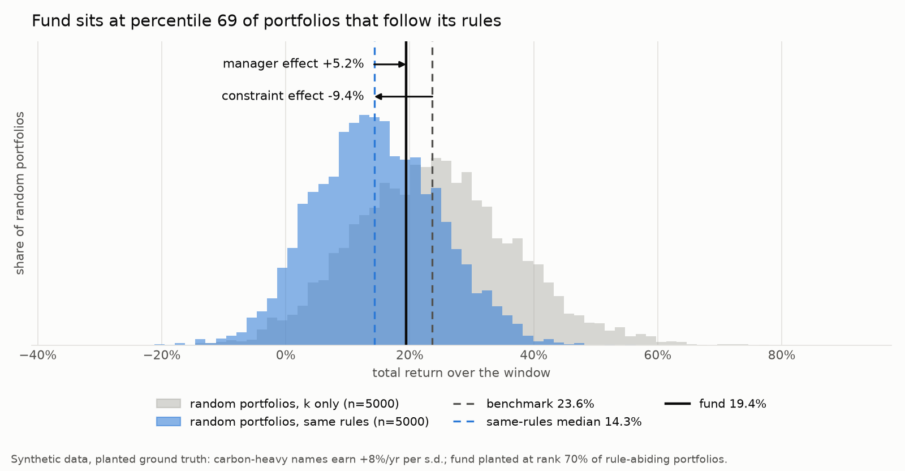
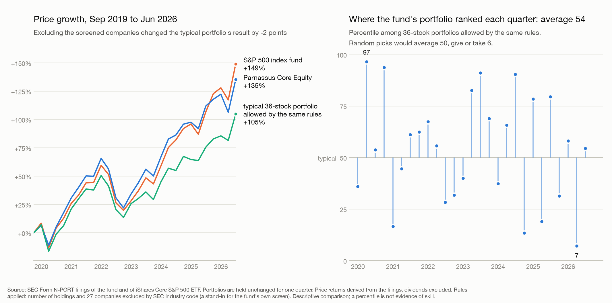

# FairBench

When an ESG fund underperforms, is it the manager or the rules? FairBench answers that with
random-portfolio benchmarking: it samples many portfolios that obey the *same* rules as the
fund, builds the distribution of their returns, and ranks the real fund in it.

Built by Team #22 for the Hanken Quantum x Finance Hackathon (8–10 October 2026).



## What it does

```
fund - benchmark = (same-rules median - benchmark)   constraint effect: what the rules cost
                 + (fund - same-rules median)        manager effect: selection within the rules
```

- **Rules** are a `ConstraintSet` built from ten constraint types: number of holdings, sector caps,
  exclusions, ESG floor, carbon cap, group shares (a flag, a country), averages of any numeric
  field, minimum number of sectors or countries, and volatility or tracking-error caps.
- **The sampler is pluggable.** Classical rejection sampling is the default. A constraint-preserving
  quantum circuit (Dicke state + XY mixer) that only outputs portfolios with exactly k holdings
  drops in as an alternative backend.
- **The output** is the constraint/manager split, the fund's percentile among rule-abiding
  portfolios, Monte Carlo confidence intervals, and a plot.
- **An AI layer reads the mandate.** Claude turns a fund's policy text into a structured rule
  spec; deterministic code compiles that spec into the numeric constraints above and reports
  what each sentence became, including the rules it could not express.

## Status, stated plainly

- **All attribution results so far use synthetic data** with a planted ground truth. No real fund has been analysed.
  One real fund has been run through the pipeline for real US funds (Parnassus Core Equity, see below), under a
  proxy mandate: holdings count and an exclusion list from SEC industry codes, price returns without dividends.
- **No quantum speedup was found.** Three routes were benchmarked against strong classical baselines:

| Route | Result |
|---|---|
| Dicke state + filter | Same distribution as classical rejection sampling. A correctness baseline, not an advantage. |
| Trained layers | Acceptance 0.24 → 0.32 on a toy case, at the cost of non-uniform samples; negligible gain on the hard "island" case. |
| Quantum-enhanced MCMC | Exact spectral gaps at n ≤ 16: no evidence of advantage. A classical walk given the same feasibility oracle does at least as well. |
| Amplitude amplification | Fault-tolerant resource estimate: ~10⁴× slower than classical at n = 100–200. Break-even needs a feasible fraction below ~1e-9 to 1e-12; our synthetic rule family sits at 0.01–0.2. |

- **The AI layer has not yet been run against the live API** in this repo. It is covered by
  offline tests with a fake client and by a dry run of the same prompt (see below).
- Quantum circuits run on simulators only (`aer_statevector`, `aer_mps`). The hardware backends are stubs.
- The quantum penalty and oracle encodings cover the original five constraint types; the five
  newer ones are enforced by the samplers and the attribution only.

Numbers and protocols are in [`BUILD_PLAN.md`](BUILD_PLAN.md); the review-safe wording for each finding is in
[`PITCH_PLAN.md`](PITCH_PLAN.md); [`fairbench_handoff.md`](fairbench_handoff.md) is the short entry point.

## Quick start

Requires Python 3.11 and [uv](https://docs.astral.sh/uv/).

```bash
git clone https://github.com/lalashutosh/FairBench.git && cd FairBench
uv venv --python 3.11 .venv
uv pip install -e ".[dev]"
```

Run the attribution demo (a few seconds):

```bash
.venv/bin/python scripts/demo_attribution.py
```

It prints the attribution for a synthetic 100-asset case, then repeats a 16-asset case with
classical rejection, the Dicke circuit and exact enumeration to show they agree. Outputs go to
`results/attribution_demo.{png,json}` and `results/attribution_samplers.csv`.

See the whole pipeline in one command (a policy text to formulas, the real fund's rank, the quantum estimate;
no network, a few seconds):

```bash
.venv/bin/python scripts/demo_pipeline.py
```

Run the tests (about 40 s):

```bash
OMP_NUM_THREADS=4 .venv/bin/python -m pytest -q
```

## From mandate text to constraints

```
mandate text ──Claude, structured output──▶ rule spec (JSON) ──compile_spec──▶ ConstraintSet + report
```

```bash
.venv/bin/python scripts/demo_mandate.py
```

This reads [`examples/mandate_example.txt`](examples/mandate_example.txt) (a fictional fund),
loads the hand-written reference spec beside it, compiles it and runs the attribution. Of the
18 rules in the example, 14 are enforced, 1 holds trivially and 3 are reported as not
expressible:

```
[mapped  ] require            only region in ['Nordic', 'Western Europe'] (123 assets eligible): excludes ... (27 assets)
           source: "The Fund invests only in companies domiciled in the Nordic region or Western Europe."
[mapped  ] group_limit        at most floor(25% x 20) = 5 names in each country (10 of them)
[mapped  ] portfolio_average  CarbonCap(average <= 124)  [relative_to_mean 0.75; universe mean 165.3]
[mapped  ] portfolio_average  AvgBound(average board_women_pct >= 34)  [absolute 34; universe mean 33.31]
[mapped  ] group_limit        CountBound(at least ceil(50% x 20) = 10 names in assets flagged sbti_target; 80 such assets)
[mapped  ] risk_limit         TrackingErrorCap(tracking error <= 6.0% against the equal-weight universe)
[unmapped] unmapped           A target that changes from year to year needs a time series of carbon data ...
           source: "The Fund aims to reduce the carbon intensity of the portfolio by 7% each year."
```

To let Claude do the extraction, install the extra, set a key and add `--live` (one API call):

```bash
uv pip install -e ".[dev,ai]"
```

```bash
export ANTHROPIC_API_KEY=...   # your own key; never commit it
```

```bash
.venv/bin/python scripts/demo_mandate.py --live
```

In code:

```python
from fairbench.mandate import mandate_to_constraints
compiled, extraction = mandate_to_constraints(open("policy.txt").read(), u, k=30)
print(compiled.report())                 # every rule, its quote, and what it became
res = attribute(u, compiled.constraint_set, fund_holdings)
```

How the two halves divide the work:

- **The model translates, the code computes.** The model only sees names and scales (sectors,
  flags, tickers, min/mean/max of the scores), never per-asset values. It writes rules in the
  mandate's own terms ("0.7 x the universe average"); thresholds, counts and excluded assets
  are computed by `fairbench/rules.py`, so one spec always gives the same constraints.
- **Every rule carries a verbatim quote**, and the code checks that the quote is in the text.
- **Nothing is dropped silently.** Rules with no numeric form here (taxonomy alignment,
  stewardship, another provider's rating scale) come back as `unmapped` with the reason.
- A spec is plain JSON, so it can be written or corrected by hand and saved next to the fund.

What a mandate sentence can become:

| Rule kind | Example sentence | Constraint |
|---|---|---|
| `holdings` | "holds between 18 and 22 positions" | `Cardinality` |
| `position_cap` | "no holding above 7%" | checked against 1/k |
| `sector_cap` | "no more than 15% in any one sector" | `SectorCap` |
| `exclude` | "no tobacco or controversial weapons" | `Exclusion` |
| `require` | "only companies domiciled in the Nordic region" | `Exclusion` of the rest |
| `exclude_threshold` | "lowest 20% ESG in each sector not eligible", "market cap below EUR 1bn excluded" | `Exclusion` |
| `group_limit` | "at least half in companies with science-based targets", "max 25% per country" | `CountBound` |
| `threshold_share` | "at least 60% of holdings score 55 or more" | `CountBound` |
| `portfolio_average` | "average carbon 25% below the universe", "boards at least 34% women on average" | `MinESG`, `CarbonCap`, `AvgBound` |
| `min_groups` | "spread across at least eight sectors" | `MinGroups` |
| `risk_limit` | "tracking error will not exceed 6% per year" | `TrackingErrorCap`, `VolatilityCap` |
| `unmapped` | "reduce carbon intensity by 7% each year", stewardship commitments | none, reported |

The universe CSV supplies the data the rules refer to: `flag_<name>` columns (yes/no
involvement), `attr_<name>` columns (numbers such as market cap) and `cat_<name>` columns
(labels such as country). Shares and averages assume equally weighted holdings.

## Real funds from public filings

First real run, 2026-10-09: **Parnassus Core Equity against 27 quarters of S&P 500 portfolios**
(2019-09-30 to 2026-06-30), entirely from SEC filings.



- Its disclosed portfolios, held one quarter at a time, grew +135% in price terms; the S&P 500 index
  fund +149%; the typical 36-stock portfolio allowed by the same rules +105%.
- Quarter by quarter the fund's portfolio ranked at percentile 54 on average among those portfolios
  (50 is typical; random picks would average 50 give or take 6). That is not distinguishable from 50.
- Excluding 27 fossil-fuel, tobacco, alcohol and weapons companies moved the typical portfolio's result
  by -2 points over the whole period.
- **This is a proxy mandate.** The rules applied are the number of holdings and an exclusion list built from SEC
  industry codes. The fund's own ESG research cannot be reproduced from public data. Returns are price returns
  derived from the filings, without dividends. A percentile is not evidence of skill.

```
SEC EDGAR --polite client, raw archive--> N-PORT holdings --> database (every row cites its filing)
index fund's filing --> universe + benchmark weights        fund's filing --> realised portfolio
two filings --> price returns --> reference portfolios under the same rules --> percentile
```

Try it on the synthetic example (fictional funds, a few seconds, no network):

```bash
.venv/bin/python scripts/build_example_dataset.py
```

```bash
.venv/bin/python scripts/real_fund_attribution.py --example
```

Run it on a real fund. This is the only step that contacts the SEC, and it needs you to say who
is asking (the SEC requires a contact in the `User-Agent`; the client has no default and will not
start without it):

```bash
export FAIRBENCH_SEC_USER_AGENT="Your Project Name contact@your-domain.org"
```

```bash
.venv/bin/python scripts/real_fund_ingest.py --series S000000856 --series S000004310
```

```bash
.venv/bin/python scripts/real_fund_ingest.py --series S000004347
```

```bash
.venv/bin/python scripts/build_sic_exclusions.py --parent-dir data/nport/S000004310
```

```bash
.venv/bin/python scripts/real_fund_attribution.py --fund-dir data/nport/S000000856 --parent-dir data/nport/S000004310 --price-dir data/nport/S000004347 --exclude-file data/exclusions_sic.csv --name parnassus_core_equity
```

```bash
.venv/bin/python scripts/real_fund_figure.py --name parnassus_core_equity --short-name "Parnassus Core Equity"
```

The same quarters through the quantum estimator (a noiseless simulation; see [`QUANTUM_CORE.md`](QUANTUM_CORE.md)), and a
policy text turned into its formula sheet with the region's requirements checked (fictional example, offline):

```bash
.venv/bin/python scripts/real_fund_quantum.py --fund-dir data/nport/S000000856 --parent-dir data/nport/S000004310 --price-dir data/nport/S000004347 --exclude-file data/exclusions_sic.csv --name parnassus_core_equity
```

```bash
.venv/bin/python scripts/mandate_formula_sheet.py
```

`S000000856` is Parnassus Core Equity and `S000004310` is iShares Core S&P 500, used as the
stand-in for its universe and benchmark weights. `S000004347` is iShares Russell 1000, used only to
price companies after they leave the S&P 500. The exclusion list is a stand-in built from the SEC's
industry codes. Other candidates and their identifiers are in
[`FAIRBENCH_REAL_DATA_RESEARCH_MEMO.md`](FAIRBENCH_REAL_DATA_RESEARCH_MEMO.md).

What the output means:

- The fund's **frozen-holdings return** (its disclosed portfolio, held without trading for one
  quarter) is ranked among portfolios drawn from the same universe under the same rules.
- Three **reference distributions** are reported side by side, because they are different
  objects: uniform over feasible sets of names (equal or benchmark-proportional weights),
  uniform over a grid of feasible weights, and a benchmark-aware tilt of either.
- The words are deliberately plain: *rule-conditioned return range*, *within-mandate return
  difference*, *realised portfolio percentile*. It is a descriptive comparison, not a causal
  split, and a percentile is not evidence of skill.
- Returns default to **price returns derived from the filings themselves** (value / shares at two
  dates), so dividends are missing. A total-return file can be supplied instead.
- Rules that need data the public does not have (vendor ESG ratings, provider emissions data)
  are recorded with their evidence, marked `unobservable`, and never enforced.

[`REAL_FUND_RESULTS.md`](REAL_FUND_RESULTS.md) has the result in plain words, the quarter-by-quarter table, the checks
(a made-up example with planted answers; every sampler scored against exact answers) and the list of what is
disclosed, derived, assumed and missing.

## Using it on your own data

```python
from fairbench.apps.attribution import attribute, dicke_sampler, plot_attribution
from fairbench.constraints import Cardinality, ConstraintSet, Exclusion, MinESG, SectorCap
from fairbench.data import load_universe

# universe.csv: ticker, mu, sector, esg_score, carbon      (one row per asset)
# returns.csv:  first column = date, then one column of simple returns per ticker
u = load_universe("universe.csv", returns_path="returns.csv")

rules = ConstraintSet([Cardinality(30), SectorCap("Energy", 2), MinESG(60.0), Exclusion([4, 17])])

res = attribute(u, rules, fund_holdings, n_samples=5000)           # classical rejection sampling
# res = attribute(u, rules, fund_holdings, sampler=dicke_sampler())  # Dicke circuit (small n, simulator)
print(res.summary())
plot_attribution(res, "attribution.png")
```

`fund_holdings` is a 0/1 vector over the universe or explicit weights that sum to 1. Optional
arguments: `fund_returns` (the fund's realised return series), `benchmark_returns` (an index
instead of the default benchmark), `metric="sharpe"`, `weight_scheme`.

Things to keep in mind when reading a result:

- The default benchmark is the median random portfolio with the same number of holdings and no other rule.
- Holdings are held fixed over the window; there is no turnover model.
- The confidence intervals cover Monte Carlo sampling error only.
- A percentile from one window is not evidence of skill.
- A fund whose holdings break the rule set is flagged, because the null is then not its null.

## Layout

```
fairbench/
  data.py, constraints.py, instances.py     universe, the ten constraint classes, benchmark instances
  baselines.py, chains.py, metrics.py       classical samplers, MCMC chains, sampler metrics
  backends.py, training.py, objectives.py   circuit sampling backends and ansatz training
  postprocess.py                            filtering, repair, portfolio weights
  rules.py                                  rule spec (JSON) and its compilation into constraints
  mandate.py                                AI layer: mandate text to rule spec (Claude)
  quantum/                                  Dicke state, XY mixer ansatz, Hamiltonians, MCMC proposal
  ft/                                       fault-tolerant oracle and resource model (amplitude amplification)
  apps/attribution.py                       the attribution tool (synthetic universes)
  apps/real_fund.py                         a real fund against its feasible portfolios, period by period
  apps/real_fund_quantum.py                 the same period handed to the quantum estimator
  ingest/                                   SEC client and raw archive, N-PORT and EDGAR parsers, identifiers,
                                            document parser, return sources, ingestion pipeline
  store/                                    SQLite schema and helpers; every row carries its provenance
  mandates/                                 canonical constraints: hard/soft wording, evidence checks, regional
                                            rule packs, the formula sheet, compilers
  portfolio/                                weight grid, reference distributions, exact validator, MILP, holdings changes
  quantum/encoding.py                       Stage 2 (weights) as binary variables and a QUBO
examples/                                   a fictional mandate and its rule spec; a synthetic N-PORT example
scripts/                                    demos and the benchmark studies
results/                                    CSV, JSON and plots produced by the scripts
tests/                                      pytest suite
```

## Memory note

Some study scripts are heavy. Cap threads, and for the largest ones cap memory too:

```bash
ulimit -v 4000000; OMP_NUM_THREADS=1 OPENBLAS_NUM_THREADS=1 timeout 1500 .venv/bin/python -u scripts/aa_estimate.py
```

Do not use `ulimit -v` with the test suite: Qiskit Aer reserves virtual memory and fails.
