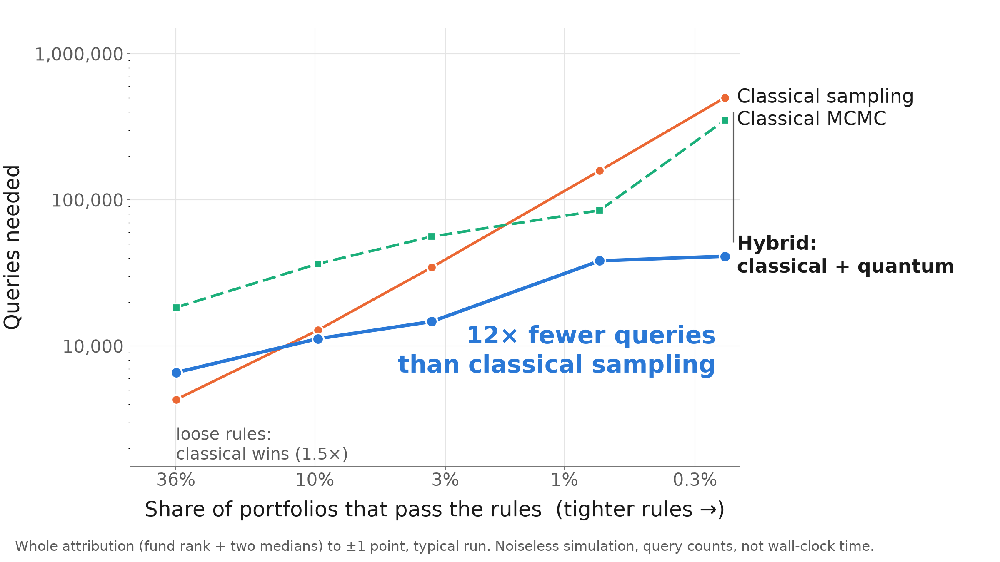
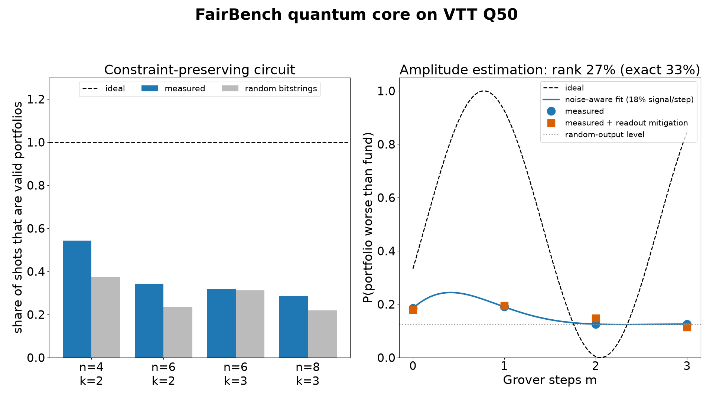

# FairBench

**Is it the manager, or the mandate?** FairBench is rules-adjusted performance benchmarking for
constrained (ESG) funds. It ranks a real fund against thousands of random portfolios that obey the
*same* investment rules, so the cost of the rules and the choices made inside them are reported
separately. That rank is a fraction of a set of portfolios, which is exactly the quantity quantum
amplitude estimation computes, so one pipeline feeds two estimators: a classical one that runs today
and a quantum one, validated in simulation and characterised on a 50-qubit quantum computer.

Team #22 · Hanken Quantum x Finance Hackathon · 8–10 October 2026 · Python 3.11, Qiskit


## At a glance

| | |
|---|---|
| **Problem** | An ESG fund trails its index. Was it the manager's picks, or the rules the fund must follow? An index benchmark, a peer group and Brinson attribution cannot separate the two. |
| **Solution** | Sample the portfolios the fund's own rules allow, then report where the real fund ranks among them (0–100; 50 is the typical rule-abiding portfolio) and what the rules cost against the market. |
| **Real data** | Nine real US funds, 224 fund-quarters, 2019–2026, built only from free SEC N-PORT filings. No paid data, no finance API. |
| **Finding** | All eight ESG funds rank inside the range luck alone would give. The control fund is flagged in 13 of 26 quarters. For Parnassus Core Equity, the 14-point gap to the S&P 500 comes mostly from holding 36 stocks in a market led by a few giants; its exclusions cost about 2 points. |
| **Quantum, in theory** | Quantum amplitude estimation (QAE) over a constraint-preserving Dicke-state circuit needs quadratically fewer oracle queries: 12× fewer than classical sampling on the tightest rule set, 2.4× on the real fund's quarters (noiseless simulation). |
| **Quantum, in practice** | The circuit ran on VTT's 50-qubit Q50 through LUMI. It produced valid portfolios 54% of the time against 37.5% by chance. A digital twin calibrated on that data says what hardware the advantage needs. |
| **AI** | Claude reads a fund's policy text into a rule spec; deterministic code compiles it into constraints and shows, sentence by sentence, what was enforced and what could not be. Tested offline on a fictional mandate. |
| **Demo** | One command, offline, a few seconds: `scripts/demo_pipeline.py`. |
| **Engineering** | 1,184 offline tests. Every number on this page is written by a script in `scripts/` to a file in `results/`. |
| **Honest scope** | No quantum advantage on today's hardware, and none is claimed. A rank is a description, not proof of skill. Four other quantum routes were tested and ruled out; they are reported below. |

## The problem

An ESG fund must follow rules: no tobacco, no fossil fuels, a carbon cap, a limit per sector, a fixed
number of holdings. When it lags the market, the fund's board, its investors and its regulator all
ask the same question, and today's tools answer a different one:

- **An index benchmark** says the fund lost to the S&P 500. The fund was never allowed to hold the S&P 500.
- **A peer group** compares it with other funds, which follow other rules.
- **Brinson and factor attribution** explain the gap by sector, stock or factor, taking the benchmark as given. They do not price the rules.

So a manager can be blamed for a mandate, or hide behind one.

## How FairBench answers it

Draw many portfolios that the fund could have held under its own rules. Their returns form a
distribution: the range of outcomes the rules allowed. Then place the real fund in it.

```
fund − benchmark = (same-rules median − benchmark)   what the rules cost
                 + (fund − same-rules median)        the choices made inside the rules
```

One pipeline, two estimators:

```
1 READ       the fund's policy text ─▶ rules, each tied to the sentence it came from     (Claude + checks)
2 CHECK      add what the fund's region requires (US names rule, EU fund-name rules)     mandates/regions.py
3 FORMULAS   every rule as mathematics on the holdings, reviewed by a person             mandates/formulas.py
4 DATA       SEC filings ─▶ universe, benchmark weights, prices, the fund's portfolio    ingest/, store/
5 ESTIMATE   "among portfolios the rules allow, where does the fund's return rank?"
             ├─ classical   random rule-abiding portfolios, counted                      today's product
             └─ quantum     the same question as one amplitude, by amplitude estimation  simulated; fault-tolerant era
6 REPORT     rank per quarter, its error bar, what the rules cost, the checks
```

Both estimators take the same three inputs: the universe (asset order is qubit order), the rule set,
and the fund's return as a threshold. The classical one draws portfolios and counts those below the
threshold. The quantum one puts the threshold inside the oracle and reads the rank as an amplitude.
`tests/test_real_fund_quantum.py` checks that they answer the same question.

| | Classical sampling | Quantum core |
|---|---|---|
| Counting rules (holdings, exclusions, sector and group counts) | yes | yes, exactly |
| Averages (ESG floor, carbon cap, any numeric field) | yes | yes, with integer-rounded coefficients |
| Minimum number of sectors; volatility and tracking-error caps | yes | no: enforced by a classical check |
| Equal weights; benchmark-proportional weights | yes | yes (the comparison is linear in the selection) |
| Capped benchmark weights, the weight grid | yes | no: not linear |
| The whole return distribution from one run | yes | no: one number per run |

## What is new

Random portfolios as a yardstick are an established idea (Surz 1994; Burns 2004). FairBench adds four things.

1. **The reference is the fund's own rule set, read from its own documents.** Policy text becomes a
   rule spec, the spec becomes formulas, the formulas become constraints. Every rule keeps the sentence
   it came from, and rules that cannot be expressed or observed are listed, never dropped.
2. **It runs on free public data.** Holdings, the investable universe, benchmark weights and prices all
   come from SEC N-PORT filings: the universe is rebuilt from an index fund's own filing, and prices are
   derived from value ÷ shares. No licensed index, price or ESG feed is needed to reproduce a result.
3. **Quantum is used for estimation, not optimisation.** Many quantum-finance prototypes search for one
   best portfolio with a heuristic (QAOA, VQE, annealing). FairBench needs a different thing, a fraction
   of a set, and for that amplitude estimation has a proven quadratic query advantage. The fund's return
   goes inside the oracle as a threshold, so the rank comes out directly and no list of portfolios is
   ever generated.
4. **Every claim is checked against a known answer.** Planted effects on synthetic data, exact
   enumeration on small universes, a control fund on real data, a real quantum computer and a digital
   twin of it. The negative results are published with the positive ones.

| Approach | Question it answers | What it leaves open |
|---|---|---|
| Index benchmark | Did the fund beat the market? | Whether the fund was allowed to hold what drove the market |
| Peer group | Did it beat similar funds? | Peers follow different rules |
| Brinson / factor attribution | Which sectors, stocks or factors explain the gap? | What the rules themselves cost |
| Custom or ESG index | How did one rule-following portfolio do? | One path, not the range the rules allow |
| Quantum portfolio optimisation | Which single portfolio is best? | No ranking; no proven speedup |
| **FairBench** | Among all portfolios the rules allow, where does this fund rank, and what did the rules cost? | Causality and skill, which no single ranking can establish |

FairBench complements the first four; it does not replace them. The longer argument, the vendor
comparison and the closest commercial neighbour are in [`WHY_FAIRBENCH.md`](WHY_FAIRBENCH.md) and
[`FAIRBENCH_INDUSTRY_STANDARDS_RESEARCH.md`](FAIRBENCH_INDUSTRY_STANDARDS_RESEARCH.md).

## Results

### 1. Nine real funds, 2019–2026

Each quarter, a fund's disclosed portfolio is frozen and its next-quarter return is ranked among
20,000 random portfolios of the same size from its own universe (value-weighted by the index fund's
weights). Under luck alone a fund's average rank is 50, and the "luck band" is where 95% of such
averages fall. "Extreme quarters" are ranks at or below 2.5 or at or above 97.5.

| Fund | Group | Universe | Quarters | Average rank | Luck band | Extreme quarters |
|---|---|---|---|---|---|---|
| Parnassus Core Equity | active ESG | S&P 500 | 27 | 50.4 | 39.1–60.9 | 0 |
| Calvert Equity | active ESG | Russell 1000 | 27 | 46.1 | 39.1–60.9 | 0 |
| Nuveen Large Cap Responsible | active ESG | Russell 1000 | 26 | 46.4 | 38.9–61.1 | 0 |
| American Century Large Cap Equity | active ESG | Russell 1000 | 26 | 50.6 | 38.9–61.1 | 0 |
| SPDR S&P 500 ESG ETF | passive ESG | S&P 500 | 23 | 54.3 | 38.2–61.8 | 0 |
| Xtrackers S&P 500 Scored & Screened | passive ESG | S&P 500 | 26 | 56.4 | 38.9–61.1 | 0 |
| iShares ESG Aware MSCI USA | passive ESG | Russell 1000 | 26 | 52.2 | 38.9–61.1 | 0 |
| iShares Paris-Aligned Climate MSCI USA | passive ESG | Russell 1000 | 17 | 47.8 | 36.3–63.7 | 0 |
| iShares MSCI USA Equal Weighted | control, not ESG | Russell 1000 | 26 | 38.7 | 38.9–61.1 | **13** |

- **The method detects a fund that really differs.** The control is an equal-weighted index fund measured
  against a value-weighted reference, a known systematic difference. It is flagged in 13 of 26 quarters
  and its average (38.7) falls just below the band.
- **The ESG funds do not differ from what their universe allowed.** 0 extreme quarters in 198, and all
  eight averages inside the band (active ESG 48.4, passive ESG 53.1). On this evidence there is neither
  a selection penalty nor selection skill to report.
- The rule set in this table is the universe and the number of holdings. Universes are index funds' own
  filings standing in for the indices. Price returns, no dividends; holdings frozen for the quarter.
  With an equal-weighted reference instead, one fund (iShares Paris-Aligned, 35.3) falls below the band.

Source: `scripts/skill_table.py`, `results/skill_table/`.

### 2. One fund in depth: Parnassus Core Equity

Here the rules also include an exclusion list: 27 fossil-fuel, tobacco, alcohol and weapons companies
identified from SEC industry codes.


| | Price growth, 2019-09 to 2026-06 |
|---|---|
| iShares Core S&P 500 ETF (the market) | +149% |
| Parnassus Core Equity | +135% |
| Typical 36-stock portfolio under the same rules | +105% |

- **The rules cost about 2 points** over the whole period (+105% with the exclusions, +107% without).
- **The gap to the index is mostly structural.** Any 36-stock portfolio tends to trail an index that a
  few very large companies drove. The fund finished 30 points ahead of the typical portfolio its rules allowed.
- **Quarter by quarter it ranked 54 of 100 on average** (luck: 50, give or take 6), ahead of the
  typical portfolio in 59% of quarters. That is not distinguishable from luck.
- This is a **proxy mandate**: the fund's own ESG research is private. This run uses capped
  benchmark-proportional weights and 5,000 portfolios per quarter, which is why its average (54)
  differs from the table above (50.4). Both are inside the band.

Quarter-by-quarter table, data checks and what is disclosed, derived, assumed and missing:
[`REAL_FUND_RESULTS.md`](REAL_FUND_RESULTS.md).

### 3. The quantum estimator, in simulation



The fund's rank is a ratio of two amplitudes. Amplitude estimation over a Dicke state (an equal
superposition of every portfolio with exactly k holdings) measures it with error falling as 1/queries,
against 1/√queries for sampling. All numbers here are noiseless simulation and count oracle queries,
not time. One query is one check of one portfolio.

| Measured | Quantum (QAE) | Classical |
|---|---|---|
| Error against queries, fitted slope | −1.00 | −0.48 |
| Queries against rule tightness P_F, exponent | about −0.5 | about −1.2 (rejection sampling) |
| Whole attribution to ±1 point, by share of portfolios the rules allow | | |
| 36% (loose rules) | | classical wins, 1.5× |
| 3.4% | 2.4× fewer queries | |
| 0.7% | 4.1× fewer | |
| 0.23% (tight rules) | **12× fewer** | |
| Against swap-MCMC | 2–9× fewer | chains get trapped: tight rules split the allowed set into 14–19 islands |
| Real fund, 27 quarters, rank to ±1 point | median 1,900 queries | median 5,366 samples (median ratio 2.4×) |
| Real fund, latest quarter, rank to ±0.1 point | 40,300 queries | 801,438 samples (19.9×) |
| Error against the exact rank (16 largest stocks) | 0.55 points | 0.79 points |

The circuit for the full universe (476 stocks, 34 held) needs about 949 error-corrected qubits and
5.0 million T gates per step. It is a fault-tolerant workload. How it works, what it can encode and
where it does not help: [`QUANTUM_CORE.md`](QUANTUM_CORE.md).

### 4. On a real quantum computer: VTT Q50



Run on 2026-10-09 on VTT's 50-qubit Q50 through the LUMI supercomputer, 2,000 shots per circuit.

| Measurement | Result |
|---|---|
| Bell pair / 4-qubit GHZ | 95.0% / 84.5% |
| Valid portfolios, 4 assets hold 2 (46 two-qubit gates) | **54%** against 37.5% by chance |
| Valid portfolios, 8 assets hold 3 (239 two-qubit gates) | 28% against 22% by chance |
| Toy amplitude estimation of a fund's rank (exact 33.3%) | 27% from a noise-aware fit: the right direction, not accurate |
| Digital twin, one fitted parameter (two-qubit error 1.8%) | reproduces the hardware data within a few points |
| Gate error the toy needs / real portfolio sizes need | about 10⁻³ / about 10⁻⁷ |

The circuit runs and beats chance. Depth is the wall: one amplitude-estimation step costs about 150
two-qubit gates even for four assets, and most of the signal is gone after it. The measured noise turns
"needs better hardware" into a number. Job ids, raw counts and the twin: [`Q50_RESULTS.md`](Q50_RESULTS.md).

### 5. What we tested and ruled out

Before amplitude estimation, four ways of using a quantum computer to *generate* rule-abiding portfolios
were benchmarked against strong classical baselines. None helps.

| Route | Result |
|---|---|
| Dicke state + filter | The same distribution as classical rejection sampling. A correctness baseline, not an advantage. |
| Trained circuit layers | Acceptance 0.24 → 0.32 on a toy case, at the cost of non-uniform samples; training cost is not paid back. |
| Quantum-enhanced MCMC | Exact spectral gaps up to 16 assets: a classical walk given the same feasibility oracle does at least as well. |
| Amplitude amplification | Fault-tolerant estimate: about 10⁴× slower than classical at 100–200 assets. Break-even needs fewer than 1 in 10⁹ portfolios to be allowed; our synthetic rule family allows 1–20%. |

Sampling gives one random portfolio per run, so it can never improve precision. Estimation can. That is
why the quantum core estimates the rank instead of generating portfolios.

### 6. From policy text to rules

On a fictional 18-rule mandate ([`examples/mandate_example.txt`](examples/mandate_example.txt)): 14
rules enforced, 1 holds trivially, 3 reported as not expressible. Each carries its quote:

```
[mapped  ] require            only region in ['Nordic', 'Western Europe'] (123 assets eligible): excludes ... (27 assets)
           source: "The Fund invests only in companies domiciled in the Nordic region or Western Europe."
[mapped  ] group_limit        at most floor(25% x 20) = 5 names in each country (10 of them)
[mapped  ] portfolio_average  CarbonCap(average <= 124)  [relative_to_mean 0.75; universe mean 165.3]
[mapped  ] risk_limit         TrackingErrorCap(tracking error <= 6.0% against the equal-weight universe)
[unmapped] unmapped           A target that changes from year to year needs a time series of carbon data ...
           source: "The Fund aims to reduce the carbon intensity of the portfolio by 7% each year."
```

- **The model translates, the code computes.** The model sees names and scales, never per-asset values.
  Thresholds, counts and excluded assets are computed by `fairbench/rules.py`, so one spec always gives
  the same constraints.
- **Every rule carries a verbatim quote**, and the code checks the quote is in the text and its numbers are in the quote.
- **Nothing is dropped silently.** Rules with no numeric form come back as `unmapped` with the reason.
- On synthetic data with a planted answer the attribution recovers it: rank 69.3 ± 0.7 against a planted 70.
- Status: tested offline with a fake client and by a dry run of the same prompt with a second model,
  which matched the hand-written reference on every enforceable rule. No live API call has been made.
  The real-fund results above do not depend on it: their rules (universe, number of holdings, exclusion
  list) were set directly.

## Run it

Requires Python 3.11 and [uv](https://docs.astral.sh/uv/).

```bash
git clone https://github.com/lalashutosh/FairBench.git && cd FairBench
uv venv --python 3.11 .venv
uv pip install -e ".[dev]"
```

The whole pipeline in one command (policy text to formulas, the real fund's rank, the quantum estimate;
no network, a few seconds):

```bash
.venv/bin/python scripts/demo_pipeline.py
```

The tests (a few minutes):

```bash
OMP_NUM_THREADS=4 .venv/bin/python -m pytest -q
```

| Demo | Command | Shows |
|---|---|---|
| Attribution on synthetic data | `.venv/bin/python scripts/demo_attribution.py` | A planted effect recovered; classical, Dicke circuit and exact enumeration agree |
| Policy text to constraints | `.venv/bin/python scripts/demo_mandate.py` | The 18-rule example above; add `--live` for one Claude API call |
| Quantum estimator | `.venv/bin/python scripts/demo_qae.py` | Loose rules (classical wins) against tight rules (quantum needs fewer queries) |
| Formula sheet and regional check | `.venv/bin/python scripts/mandate_formula_sheet.py` | Every rule as a formula, checked against EU or US requirements |
| Nine-fund table | `.venv/bin/python scripts/skill_table.py` | Rebuilds `results/skill_table/` from `results/real_data/` |

`--live` needs the extra and your own key: `uv pip install -e ".[dev,ai]"` and `export ANTHROPIC_API_KEY=...`.

### Real funds from public filings

Try the real-fund pipeline on the synthetic example first (fictional funds, a few seconds, no network):

```bash
.venv/bin/python scripts/build_example_dataset.py
.venv/bin/python scripts/real_fund_attribution.py --example
```

To run a real fund, the SEC requires a contact in the `User-Agent`. The client has no default and will
not start without it. The two ingest commands are the only steps that contact the SEC.

```bash
export FAIRBENCH_SEC_USER_AGENT="Your Project Name contact@your-domain.org"
.venv/bin/python scripts/real_fund_ingest.py --series S000000856 --series S000004310
.venv/bin/python scripts/real_fund_ingest.py --series S000004347
.venv/bin/python scripts/build_sic_exclusions.py --parent-dir data/nport/S000004310

ARGS="--fund-dir data/nport/S000000856 --parent-dir data/nport/S000004310 --price-dir data/nport/S000004347 --exclude-file data/exclusions_sic.csv --name parnassus_core_equity"
.venv/bin/python scripts/real_fund_attribution.py $ARGS      # classical: the rank per quarter
.venv/bin/python scripts/real_fund_quantum.py $ARGS          # the same quarters through the quantum estimator
.venv/bin/python scripts/real_fund_figure.py --name parnassus_core_equity --short-name "Parnassus Core Equity"
```

`S000000856` is Parnassus Core Equity. `S000004310` is iShares Core S&P 500, the stand-in for its
universe and benchmark weights. `S000004347` is iShares Russell 1000, used to price companies after
they leave the S&P 500. Other funds and their identifiers:
[`FAIRBENCH_REAL_DATA_RESEARCH_MEMO.md`](FAIRBENCH_REAL_DATA_RESEARCH_MEMO.md).

To use hand-written rules for a fund, save its policy text as `<name>.txt` and a rule spec beside it as
`<name>.rules.json` ([`examples/mandate_example.rules.json`](examples/mandate_example.rules.json) is a
complete example; `fairbench/rules.py` lists every rule kind), then run
`scripts/mandate_formula_sheet.py --mandate <name>.txt --region US --reviewer "<your name>"`.

### On your own data

```python
from fairbench.apps.attribution import attribute, dicke_sampler, plot_attribution
from fairbench.constraints import Cardinality, ConstraintSet, Exclusion, MinESG, SectorCap
from fairbench.data import load_universe

# universe.csv: ticker, mu, sector, esg_score, carbon      (one row per asset)
# returns.csv:  first column = date, then one column of simple returns per ticker
u = load_universe("universe.csv", returns_path="returns.csv")

rules = ConstraintSet([Cardinality(30), SectorCap("Energy", 2), MinESG(60.0), Exclusion([4, 17])])

res = attribute(u, rules, fund_holdings, n_samples=5000)           # classical rejection sampling
# res = attribute(u, rules, fund_holdings, sampler=dicke_sampler())  # Dicke circuit (small n, simulator)
print(res.summary())
plot_attribution(res, "attribution.png")
```

`fund_holdings` is a 0/1 vector over the universe or explicit weights that sum to 1. A policy text goes
through `fairbench.mandate.mandate_to_constraints(text, u, k=30)`. Ten constraint types are available:
number of holdings, sector caps, exclusions, ESG floor, carbon cap, group shares, averages of any
numeric field, minimum number of sectors or countries, and volatility or tracking-error caps. Twelve
rule kinds, listed in `fairbench/rules.py`, map mandate sentences onto them; one of the twelve is
`unmapped`, for sentences with no numeric form.

## Limits, stated plainly

- **A rank is a description, not proof of skill.** One quarter says nothing. Over 27 quarters the
  average has an error bar of about 6 points, so only an average above about 61 or below about 39 could
  be told apart from luck. The luck band ignores autocorrelation and the number of funds tested.
- **Proxy rules on real funds.** The rules applied are the universe, the number of holdings and, for
  Parnassus, an exclusion list from SEC industry codes. Rules that need a vendor's ESG scores or
  emissions data are recorded with their evidence, marked `unobservable`, and never enforced.
- **Price returns derived from filings**, so no dividends. Holdings are quarter-end snapshots, public
  about two months later; trades inside a quarter are invisible.
- **Quantum.** Every query-count result is a noiseless simulation. The hardware run shows feasibility
  and measures the gap; it shows no advantage. Even on fault-tolerant hardware one quantum query costs
  far more than one classical check, so fewer queries does not mean less time at analyst precision.
- **The AI reader** has been tested on one fictional mandate and never against the live API.

## Who it is for, and what comes next

**First user:** an institutional asset owner, fund-of-funds or consultant that reviews external equity
managers every quarter against mandates with ESG, carbon, sector or tracking-error rules. Today that
review is a spreadsheet reconciling the mandate document, the benchmark, the holdings and the ESG data.
FairBench turns it into a versioned, repeatable report: what the rules cost, where the manager ranked
inside them, and which rules could not be checked. It plugs in beside the benchmark and attribution
systems an institution already has.

**The classical pipeline is the product today.** The quantum core is a drop-in estimator for the few
decisive numbers, ready for fault-tolerant hardware, with its resource needs already counted.

**Next:** more funds and more quarters, so a statement about skill has statistical power; a licensed
ESG and emissions source, so the unobservable rules can be enforced; the real funds' rules read from
their prospectuses; amplitude estimation over portfolio weights; a pilot on one institution's own
mandate and holdings. Market, buyers and the closest existing product (FactSet's Cabot Reveal Plus):
[`FAIRBENCH_INDUSTRY_STANDARDS_RESEARCH.md`](FAIRBENCH_INDUSTRY_STANDARDS_RESEARCH.md).

## Hackathon journey and resources

| When | What was built |
|---|---|
| Before the event, 5–7 October | Sampling engine and ten constraint types; Dicke-state and XY-mixer circuits; classical baselines; the studies of trained circuits, quantum-enhanced MCMC and amplitude amplification that found no advantage; the attribution app; the AI mandate reader. |
| During the event, 8–10 October | Quantum amplitude estimation for the rank, with its scaling, noise and fault-tolerant cost studies; the SEC data pipeline and holdings database; the first real fund, then nine; regional rule check and formula sheet; the run on VTT Q50 and its digital twin on LUMI; the one-command demo. |

**Resources used:** Qiskit and Qiskit Aer (state-vector, matrix-product-state and noisy simulation);
VTT Q50 through LUMI and FiQCI, with FiQCI-EMS readout mitigation; LUMI CPU time for the digital twin;
SEC EDGAR and Form N-PORT filings; NumPy, pandas, SciPy (including its MILP solver), matplotlib, pytest;
the Claude API for the mandate reader; Claude Code as a coding and review assistant, credited in the
commits it co-wrote.

## Repository map

| File | What is in it |
|---|---|
| [`WHY_FAIRBENCH.md`](WHY_FAIRBENCH.md) | The argument in plain words: the problem, why existing tools miss it, why quantum fits |
| [`REAL_FUND_RESULTS.md`](REAL_FUND_RESULTS.md) | Parnassus Core Equity quarter by quarter, data checks, sampler validation (generated by `scripts/reproducibility_report.py`) |
| [`QUANTUM_CORE.md`](QUANTUM_CORE.md) | The quantum estimator: circuit, where the advantage comes from, where it does not help, input contract, studies |
| [`Q50_RESULTS.md`](Q50_RESULTS.md) | The hardware run on VTT Q50: results, digital twin, job ids |
| [`FAIRBENCH_REAL_DATA_RESEARCH_MEMO.md`](FAIRBENCH_REAL_DATA_RESEARCH_MEMO.md) | SEC data sources, fund identifiers, data gaps, licensing |
| [`FAIRBENCH_INDUSTRY_STANDARDS_RESEARCH.md`](FAIRBENCH_INDUSTRY_STANDARDS_RESEARCH.md) | Market, vendors, GIPS / SFDR / SEC rules, buyers, with sources |
| [`fairbench_handoff.md`](fairbench_handoff.md) | The team's working notes: state, next steps, conventions |

```
fairbench/
  data.py, constraints.py, instances.py     universe, the ten constraint classes, benchmark instances
  baselines.py, chains.py, metrics.py       classical samplers, MCMC chains, sampler metrics
  backends.py, training.py, objectives.py   circuit sampling backends and ansatz training
  rules.py, mandate.py                      rule spec and its compiler; the AI reader (Claude)
  mandates/                                 hard/soft wording, evidence checks, regional rule packs, formula sheet
  quantum/                                  Dicke state, XY mixer ansatz, Hamiltonians, MCMC proposal, weight-grid QUBO
  qae/                                      amplitude estimation (IQAE, MLAE), rank and median estimators, exact counting
  ft/                                       fault-tolerant oracle, its simulator and the resource model
  apps/attribution.py                       the attribution tool (synthetic universes)
  apps/real_fund.py, real_fund_quantum.py   a real fund against its feasible portfolios; the same case for the quantum core
  ingest/, store/                           SEC client, N-PORT parsers, SQLite database; every row carries its provenance
  portfolio/                                weight grid, reference distributions, exact validator, MILP
examples/                                   a fictional mandate and its rule spec; a synthetic N-PORT example
scripts/                                    demos, studies, the hardware run (hw_q50.py, hw_twin.py)
results/                                    CSV, JSON and figures written by the scripts; real_data/, skill_table/, hw/
tests/                                      pytest suite, offline
```

Heavy study scripts should be run with capped threads and memory
(`ulimit -v 4000000; OMP_NUM_THREADS=1 .venv/bin/python -u scripts/aa_estimate.py`). Do not use
`ulimit -v` with the test suite: Qiskit Aer reserves virtual memory and fails.
